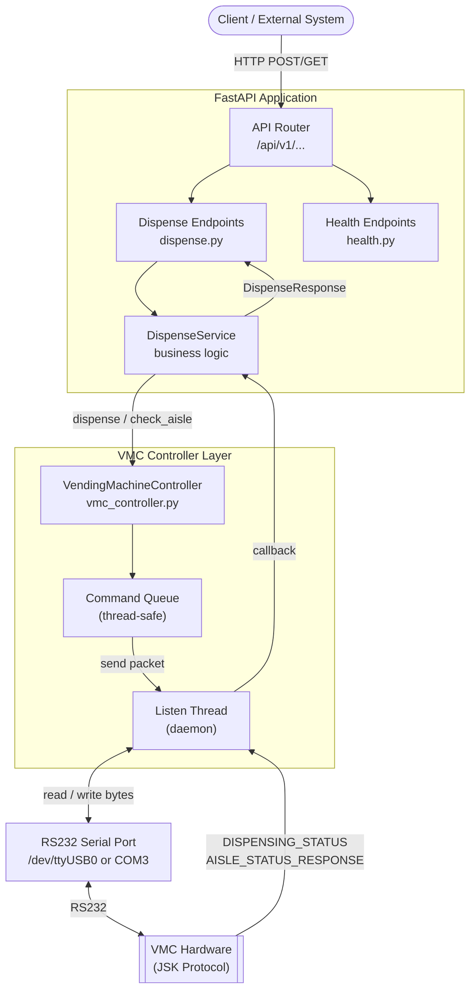
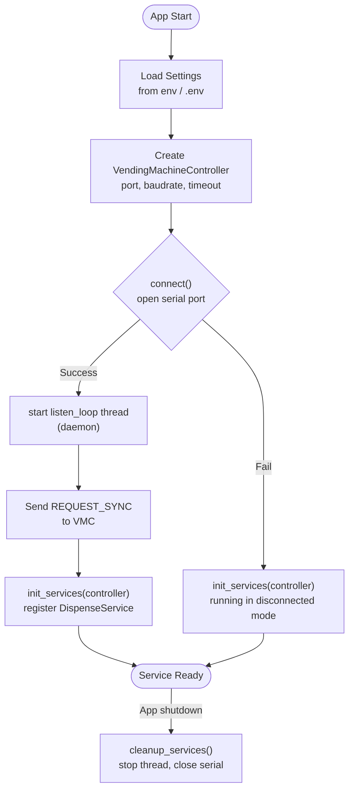
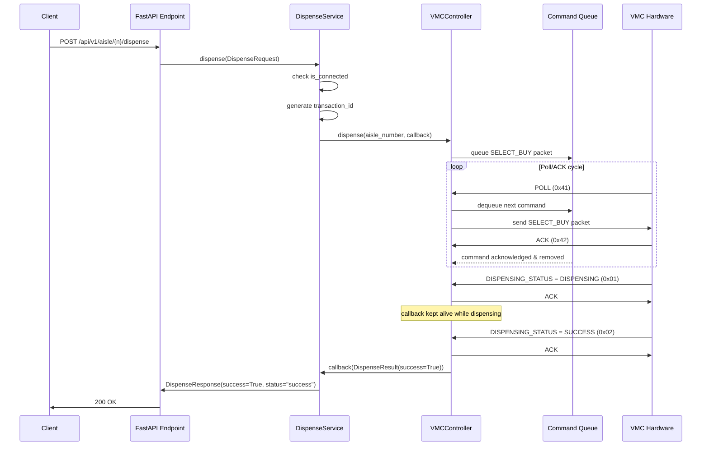
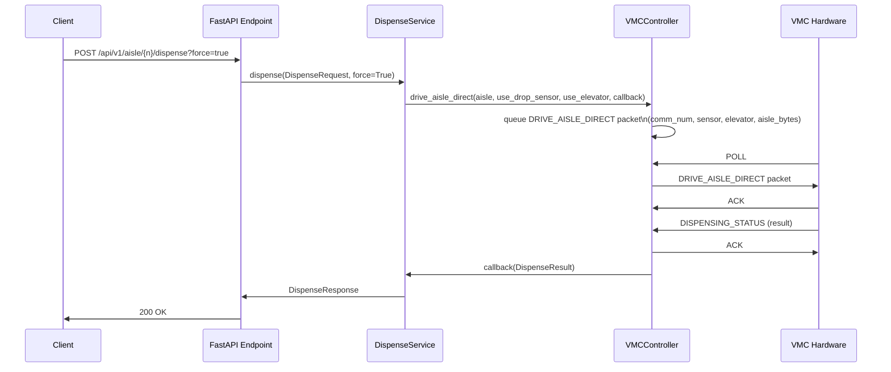
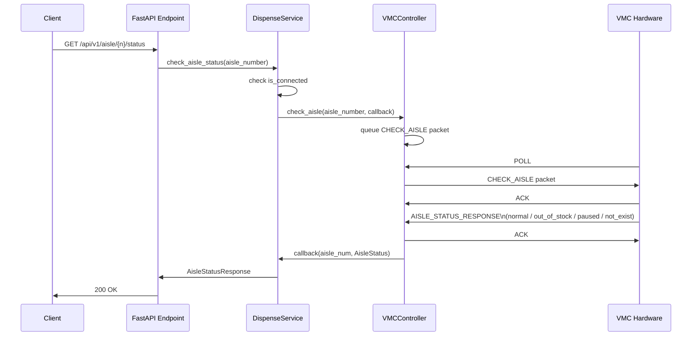
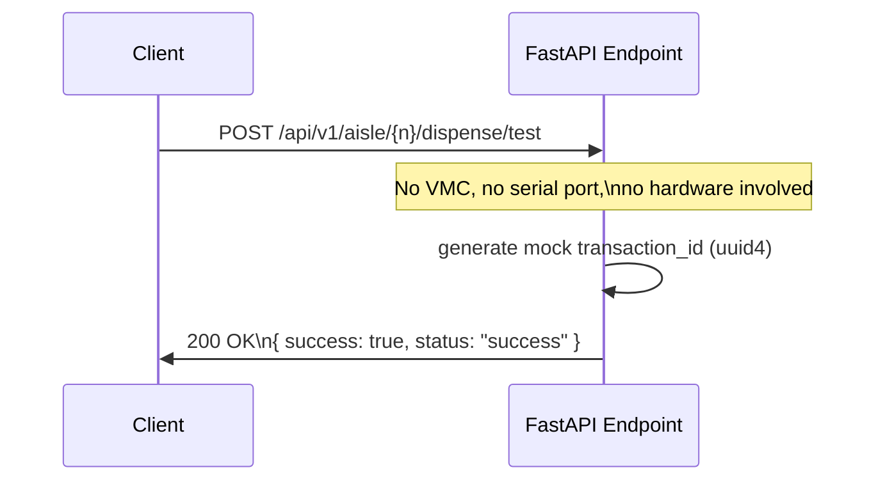

# DVM Service (Drug Vending Machine Service)
API service for controlling automated drug/medicine dispensing machines via RS232 protocol.
## Features
- RESTful API for vending machine control
- Dispense products from specified aisles/trays
- Check aisle status (stock, availability)
- Health and readiness endpoints
- Docker support with multi-stage builds
- Clean architecture with separation of concerns
## Prerequisites
- Python 3.12+
- RS232 serial port (e.g., `/dev/ttyUSB0` on Linux, `COM3` on Windows)
- VMC (Vending Machine Controller) supporting JSK protocol
## System Flowq
### Architecture Overview



### Application Startup Flow



### Sequence Diagram — Dispense from Aisle (Normal)


### Sequence Diagram — Force Dispense (Direct Drive)





### Sequence Diagram — Check Aisle Status


### Sequence Diagram — Test Dispense (No Real Dispense)



### JSK Protocol Packet Structure

```

┌─────────────────────────────────────────────────────────┐

│ STX (2 bytes) │ CMD (1 byte) │ LEN (1 byte) │ DATA ... │ XOR (1 byte) │

│ 0xFA 0xFB │ command │ data length │ payload │ checksum │

└─────────────────────────────────────────────────────────┘

```

| Command               | Code | Direction     | Description                   |
| --------------------- | ---- | ------------- | ----------------------------- |
| POLL                  | 0x41 | VMC → Service | VMC requests next command     |
| ACK                   | 0x42 | Both          | Acknowledge received packet   |
| CHECK_AISLE           | 0x01 | Service → VMC | Query aisle availability      |
| AISLE_STATUS_RESPONSE | 0x02 | VMC → Service | Aisle status result           |
| SELECT_BUY            | 0x03 | Service → VMC | Normal dispense command       |
| DISPENSING_STATUS     | 0x04 | VMC → Service | Dispense progress/result      |
| DRIVE_AISLE_DIRECT    | 0x06 | Service → VMC | Force dispense (direct motor) |
| REQUEST_SYNC          | 0x31 | VMC → Service | VMC requests info sync        |

## How to Connect to the VMC Controller

The VMC (Vending Machine Controller) communicates over an **RS232 serial port** using the JSK binary protocol. Connection is handled automatically at startup, but here is exactly what happens and how to configure it.
### Step 1 — Find Your Serial Port
**macOS**
```bash
ls /dev/cu.*
# Example output: /dev/cu.usbserial-DN45JVV4
```
**Linux**
```bash
ls /dev/ttyUSB*
# Example output: /dev/ttyUSB0
# If permission denied, add your user to the dialout group:
sudo usermod -a -G dialout $USER
# Then log out and back in
```
**Windows**
```
Device Manager → Ports (COM & LPT) → look for USB Serial Port
# Example: COM3
```
### Step 2 — Set the Serial Port in `.env`
```env
SERIAL_PORT=/dev/cu.usbserial-DN45JVV4 # macOS example
# SERIAL_PORT=/dev/ttyUSB0 # Linux example
# SERIAL_PORT=COM3 # Windows example
SERIAL_BAUDRATE=57600
SERIAL_TIMEOUT=0.1
```

> **Important:** The VMC must be set to **57600 baud, 8N1** (8 data bits, no parity, 1 stop bit). This must match on both sides.
### Step 3 — What Happens at Startup
When the service starts, `main.py` runs this sequence automatically:

1. Read SERIAL_PORT and SERIAL_BAUDRATE from config
2. Create VendingMachineController(port, baudrate, timeout)
3. Call controller.connect()
	- Opens serial.Serial(...) with 8N1 settings
	- Sets _connected = True on success
4. Call controller.start()
	- Spawns background listen_loop thread (daemon)
	- Sends REQUEST_SYNC (0x31) to VMC to handshake
5. Register DispenseService with the connected controller

> If the serial port is not found or the VMC is off, the service still starts but runs in **disconnected mode** — all dispense calls will return `success: false, message: "VMC not connected"`.

### Step 4 — Verify Connection

```bash
curl http://localhost:8000/api/v1/health
```

```json
{
   "status":"healthy",
   "vmc_connected":true,
   "serial_port":"/dev/cu.usbserial-DN45JVV4"
}
```

If `vmc_connected` is `false`, check your serial port path and that the VMC is powered on.

---
## How to Dispense a Drug
Once the service is connected, dispensing is done via a simple HTTP POST call. Here is the complete picture of what happens from API call to physical dispense.
### Quick Start — Dispense from Aisle

```bash
# Dispense from aisle number 1
curl -X POST http://localhost:8000/api/v1/aisle/1/dispense
```

```json
{
   "success":true,
   "aisle_number":1,
   "status":"success",
   "message":"Dispense successful",
   "transaction_id":"txn_3f8a1c9e2b4d"
}
```
### What Happens Internally (Step by Step)
1. POST /api/v1/aisle/1/dispense arrives at dispense_from_aisle()
	- Wraps aisle_number into DispenseRequest
2. DispenseService.dispense(request) is called
	- Checks controller.is_connected → if False, returns error immediately
	- Generates a unique transaction_id (e.g. txn_3f8a1c9e2b4d)
	- Creates an asyncio.Future to wait for the VMC response
3. VMCController.dispense(aisle_number, callback) is called
	- Builds SELECT_BUY (0x03) packet: [0xFA, 0xFB, 0x03, 0x03, comm_num, aisle_high, aisle_low, XOR]
	- Adds packet to the command_queue (thread-safe)
4. Background listen_loop thread receives POLL (0x41) from VMC hardware
	- Dequeues SELECT_BUY packet from command_queue
	- Writes packet to serial port
5. VMC hardware receives SELECT_BUY
	- Replies with ACK (0x42) → command removed from queue
	- Starts motor to push product out of aisle
6. VMC hardware sends DISPENSING_STATUS (0x04) = DISPENSING (0x01)
	- Service replies with ACK, keeps waiting
7. VMC hardware sends DISPENSING_STATUS (0x04) = SUCCESS (0x02)
	- Service replies with ACK
	- Callback fires with DispenseResult(success=True)
	- asyncio.Future is resolved
8. DispenseService maps result → DispenseResponse
	- Returns to endpoint → 200 OK sent to client
### Dispense Options Explained
| aisle_number      | required | Which aisle/tray to dispense from (1-based)                                 |
| ----------------- | -------- | --------------------------------------------------------------------------- |
| `force`           | `false`  | Use DRIVE_AISLE_DIRECT instead of SELECT_BUY (bypasses stock/status checks) |
| `use_drop_sensor` | `true`   | Detect product drop (only used when `force=true`)                           |
| `use_elevator`    | `false`  | Use elevator mechanism after dispensing (only used when `force=true`)       |
### Normal Dispense vs Force Dispense
**Normal dispense** — sends `SELECT_BUY (0x03)`. The VMC does its own validation (checks stock, aisle status) before dispensing.

```bash
curl -X POST http://localhost:8000/api/v1/aisle/1/dispense
```

**Force dispense** — sends `DRIVE_AISLE_DIRECT (0x06)`. Directly drives the motor, bypassing VMC-side stock checks. Use this when you need to dispense regardless of the VMC's internal state.

```bash
curl -X POST "http://localhost:8000/api/v1/aisle/1/dispense?force=true"
```

**Full options** — use `/api/v1/dispense` for full control:

```bash

curl -X POST http://localhost:8000/api/v1/dispense \
-H "Content-Type: application/json" \
-d '{
   "aisle_number":3,
   "force":true,
   "use_drop_sensor":true,
   "use_elevator":false
}'

```
### Possible Dispense Responses

| `status`      | `success` | Meaning                                              |
| ------------- | --------- | ---------------------------------------------------- |
| `success`     | `true`    | Product dispensed successfully                       |
| `dispensing`  | —         | Still in progress (internal, not returned to client) |
| `failed`      | `false`   | Generic failure or timeout (30s)                     |
| `jammed`      | `false`   | Product got stuck in the aisle                       |
| `motor_error` | `false`   | Motor did not stop (hardware fault)                  |
| `not_found`   | `false`   | Motor/aisle does not exist in the VMC                |
### Test Without Real Hardware
Use the test endpoint to verify your integration without touching the VMC:

```bash

curl -X POST http://localhost:8000/api/v1/aisle/5/dispense/test

```

```json

{
   "success":true,
   "aisle_number":5,
   "status":"success",
   "message":"Test dispense from aisle 5 successful (no real dispense)",
   "transaction_id":"a1b2c3d4-e5f6-..."
}

```

No serial port, no VMC, no motor is involved — safe to use in any environment.

---
## Installation
### Local Development

```bash

# Clone repository
git clone <repository-url>
cd dvm-service

# Create virtual environment
python3 -m venv env
source env/bin/activate # Linux/macOS

# or: env\Scripts\activate # Windows

# Install dependencies
pip install -r requirements.txt

# Copy environment file
cp .env.example .env

# Edit .env with your serial port configuration

# Run development server
uvicorn app.main:app --reload --host 0.0.0.0 --port 8000

```
## Configuration
Environment variables (set in `.env` file):

| Variable          | Default      | Description         |
| ----------------- | ------------ | ------------------- |
| `APP_NAME`        | DVM Service  | Application name    |
| `DEBUG`           | false        | Debug mode          |
| `SERIAL_PORT`     | /dev/ttyUSB0 | Serial port for VMC |
| `SERIAL_BAUDRATE` | 57600        | Serial baud rate    |
| `API_PORT`        | 8000         | API server port     |
## API Endpoints
### Health

| Method | Endpoint         | Description                  |
| ------ | ---------------- | ---------------------------- |
| GET    | `/api/v1/health` | Health check with VMC status |
| GET    | `/api/v1/ready`  | Readiness check              |
### Dispense

| Method | Endpoint                                     | Description                                    |
| ------ | -------------------------------------------- | ---------------------------------------------- |
| POST   | `/api/v1/dispense`                           | Dispense with full options                     |
| POST   | `/api/v1/aisle/{aisle_number}/dispense`      | Simple dispense from aisle                     |
| POST   | `/api/v1/aisle/{aisle_number}/dispense/test` | Test dispense (mock success, no real dispense) |
| GET    | `/api/v1/aisle/{aisle_number}/status`        | Check aisle status                             |
### API Documentation
- Swagger UI: `http://localhost:8000/docs`
- ReDoc: `http://localhost:8000/redoc`
- OpenAPI JSON: `http://localhost:8000/openapi.json`
## Usage Examples
### Dispense from aisle

```bash

# Simple dispense
curl -X POST http://localhost:8000/api/v1/aisle/1/dispense

# Dispense with options

curl -X POST http://localhost:8000/api/v1/dispense \

-H "Content-Type: application/json" \

-d '{
   "aisle_number":1,
   "use_drop_sensor":true,
   "use_elevator":false,
   "direct_drive":false
}'

```
### Check aisle status

```bash

curl http://localhost:8000/api/v1/aisle/1/status

```
### Health check

```bash

curl http://localhost:8000/api/v1/health

```
## Response Examples
### Successful dispense

```json

{
   "success":true,
   "aisle_number":1,
   "status":"success",
   "message":"Product dispensed successfully",
   "transaction_id":"txn_abc123def456"
}

```
### Aisle status

```json

{
   "aisle_number":1,
   "status":"normal",
   "message":"Aisle is ready"
}

```
## Serial Port Setup
### macOS

```bash

# List available serial ports
ls /dev/cu.*

# Your USB serial adapter will appear as:
# /dev/cu.usbserial-XXXXX (e.g., /dev/cu.usbserial-DN45JVV4)

# Set in .env or export
export SERIAL_PORT=/dev/cu.usbserial-DN45JVV4

# Run locally (Docker cannot access serial on macOS)
uvicorn app.main:app --reload --host 0.0.0.0 --port 8000

```
### Linux

```bash
# Add user to dialout group for serial access
sudo usermod -a -G dialout $USER

# Check serial port
ls -la /dev/ttyUSB*

# Test connection
screen /dev/ttyUSB0 57600

# Run with Docker
SERIAL_PORT=/dev/ttyUSB0 docker compose --profile linux up -d
```
